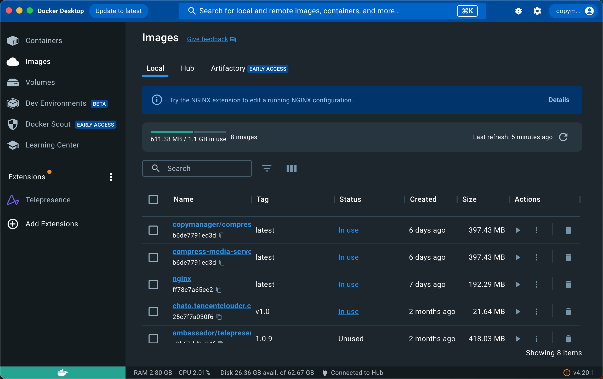

# Docker
  > Docker 是一个开源的应用容器引擎，让开发者可以打包他们的应用以及依赖包到一个可移植的容器中，然后发布到任何流行的 Linux 机器上，也可以实现虚拟化。

  > 容器是完全使用沙箱机制，相互之间不会有任何接口（类似 iPhone 的 app）。几乎没有性能开销，可以很容易地在机器和数据中心中运行。最重要的是，他们不依赖于任何语言、框架或包装系统。
  
  > 推荐学习地址：[Dcoker 从入门到实践](https://yeasy.gitbook.io/docker_practice/)
## 一、什么是Docker
  ### 1、讲个故事：
  <br>
  假如我们要盖一所房子，可能需要先画图纸、打地基、搬砖砌墙，一顿操作终于改好了。
  <br>
  如果我们住了一段时间，有一天，突然心血来潮想搬到海边去，没办法，我们只能再次画图纸、打地基、搬砖砌墙。
  <br>
  正在我们烦恼之际，突来有种魔法，它可以把我们的房子复制一份，做成一个镜像，直接放在书包里面，到了海边，我们直接把房子从书包里面拿出来就可以，实现拎包入住。
  <br>
  是不是很神奇，应用到我们项目中来，房子就是项目本身，镜像就是项目的复制，背包就是镜像的仓库。我们直接从镜像仓库中取出镜像可以应用在任何地方。

  ### 2、虚拟机和容器
  #### 1、虚拟机（`Virtual Machine`）
  + 虚拟化的硬件，通过软件来模拟的具有独立完整硬件系统功能，且运行在一个完全隔壁环境中的完整计算机系统。在实体计算机能够完成的工作在虚拟机中也可以完成。
  + 在计算机中创建虚拟机需要把计算机的部分硬盘、内存容量作为虚拟机的硬盘、内存容量。每个虚拟机都有独立的CMOS 、硬盘和操作系统，我们可以想使用计算机一样使用它。
  + 常见虚拟机有：`VMWare` 、`OpenStack`
  #### 2、容器
  + 把操作系统虚拟化，是一个标准的软件单元
  + 随时随地运行：容器可以把软件代码、配置文件、相关依赖进行打包，从而确保可以在任何环境下运行。
  + 高资源的利用率：容器提供进程级别的隔离，可以精细化的设置CPU和内存的使用率，从而更好的利用计算机资源。
  + 快速启动：每个容器都可以作为单独的进程予以运行，并且在共享底层操作系统的资源，从而加快容器的启动和停止效率。
  #### 3、虚拟机和容器区别
  + 虚拟机虽然可以隔离出多个子电脑，但是占空间大、启动速度慢，而且部分收费。
  + 容器不需要虚拟出一个操作系统，只需要虚拟出一个很小的运行环境，类似于沙盒。
  + 容器的运行空间不需要虚拟出整个操作系统，通常虚拟机大小在几GB到几十GB之间，而容器的大小在几KB到几十MB之间
  #### 4、区别明细
  | 特点 | 虚拟机 | 容器 |
  |--------|--------|--------|
  | 隔离级别 | 操作系统级别 | 进程级别 |
  | 隔离策略 | 虚拟监控机 | 控制群组 |
  | 系统资源 | 5%-15% | 0-5% |
  | 镜像大小 | GB-TB | KB-MB |
  | 启动速度 | 分钟 | 秒 |
  | 集群规模 | 上百 | 上万 |

## 二、Docker 核心概念
+ 三大核心：镜像`Image`、容器`Container`、仓库`Repository`
+ 阶段：构建`Build`、运输`Ship`、运行`Run`
+ Docker 本身不是容器，它是应用容器引擎，而镜像是容器的基础，容器是镜像的运行实例
+ 一次搭建、处处运行
+ Docker 技术使用 `Linux` 内核功能（`Cgroups`和`Namespace`）来隔离进程，以便各个进程之间可以不受到影响
+ 由于`Cgroups`和 `Namespace` 技术只存在`Linux`内核上，那容器无法运行在其他操作系统上，那在`Macos`和`windows`上如何运行呢？其实`Docker`在非`Linux`上会安装一个`Linux`虚拟机，而容器跑在这个虚拟机上。
+ 镜像：它是一个可执行的包，包含了执行时的代码、配置文件、依赖文件等

## 三、安装使用Docker
### 1、命令行安装
**在Mac中利用Homebrew**
```shell
  brew cask install docker
```
### 2、查看版本
```shell
  docker -v
```

### 3、安装桌面端（可省略，但是强烈建议）
+ 安装地址：https://www.docker.com/
+ 安装后：


### 4、配置镜像源加速
**默认情况下，Docker 使用 Docker Hub 作为官方的默认镜像源。但是，如果你在中国或其他地区使用 Docker，可能会遇到下载速度较慢的问题，这时你可以配置国内的镜像源地址来加速下载。**
+ 如果你没安装 Docker Desktop for Mac 可以通过终端配置：
```shell
    # 1、打开Docker 配置文件
    sudo nano /etc/docker/daemon.json 
    # 2、配置文件中加入
    {
      "registry-mirrors": [
        "http://hub-mirror.c.163.com/",
        "https://registry.docker-cn.com"
      ],
      "insecure-registries":[],
      "experimental": false,
      "debug": true
    }
    # 重启Docker
    sudo systemctl restart docker
```
+ 如果安装了Docker桌面端，可以在Docker的 Setting -> Docker Engine 中加入上述配置

## 四、Docker 常见指令
**安装Docker后我们先从如何构建镜像学起，构建镜像需要先知道以下指令**
### 1、基本指令
  | 指令名 | 作用 |
  |--------|--------|
  | FROM | 基于哪个镜像来实现 |
  | MAINTAINER | 镜像作者 |
  | as | 给构建过程的阶段一个标识，通常用在多阶段构建，用来标识不同的构建阶段，方便在后续阶段的操作中引入改阶段 |
  | WORKDIR | 工作目录 |
  | ENV | 声明环境变量 |
  | ADD | 把宿主机的文件复制到容器中，压缩文件会自动解压 |
  | COPY | 和COPY功能类似，实现复制功能，但是压缩文件不会自动解压 |
  | RUN | 需要运行的命令 |
  | CMD | 容器启动时(docker run)需要的指令，如果执行 docker run + 指令会覆盖掉CMD中的  | 
  | EXPORT | 容器内可以使用的端口 |
  | VOLUMN | 数据卷，把宿主机目录影响到容器中的目录 |

### 2、构建镜像
+ 基础指令： docker build [OPTIONS] PATH
<br/>
+ OPTIONS有哪些配置项：
<br/>
```sh
  -t # 指定镜像名称和标签
  -f # 指定要使用的 Dockerfile 文件路径，如果你的Dockerfile配合文件不在的当前目录
  --build-arg # 设置构建过程中的构建参数，在Dockerfile中可以通过 ARG 来声明接受构建参数
  --target # 用于在多阶段构建中指定目标构建阶段的名称， 多阶段构建时，可以使用 AS 关键字给不同的构建阶段命名，并通过 --target 参数来指定构建的目标阶段。
  --no-cache # 强制Docker不使用缓存，从头到尾构建
```
+ 例如：
```sh
  # .代表Dockerfile配置文件在当前目录，构建了一个my_images:my-image-tag 的镜像
  docker build -t my_images:latest .
  # 配置文件在Dockerfile目录下，构建参数是ENVIRONMENT=production，不使用缓存
  docker build -t  my_images:my-image-tag -f Dockerfile --build-arg ENVIRONMENT=production --no-cache .
```
+ 查看构建好的镜像
```sh
  docker image ls
```

### 3、运输镜像
**构建好的镜像可以保存在本地或上传到Docker hub或其他镜像仓库**
#### 打包成压缩文件
+ 保存镜像为 tar 文件：
```sh
  docker save -o my-image.tar my-image:latest
```
+ 加载 tar 文件中的镜像：
```sh
  docker load -i my-image.tar
```
#### 上传到 Docker Hub
+ 登录 Docker Hub：
```sh
  docker login
```
+ 在Docker Hub 中创建一个空间（`Namespace`）、仓库（`repository` 可以先不用创建），例如创建另一个名为 `copymanager` 空间
+ 给待上传的镜像打标签
```sh
  docker tag local_image_name:tagname copymanager/local_image_name:tagname
```
+ 上传：
```sh
  docker push copymanager/local_image_name:tag
```
#### 上传到私有镜像仓库
1. 搭建私有镜像仓库：需要搭建自己的私有镜像仓库，比较常用的有 Docker Regisry，Harbor等。这些镜像仓库允许你在公司内部创建并管理空间，上传和管理镜像，并设置权限。
2. 登录私有镜像仓库：上传镜像前需要先登录
```sh
  docker login your_private_registory_url --username xxx --password xxx
```
3. 上传镜像:
```sh
  docker tag local_image_name:tagname copymanager/local_image_name:tagname # 也可以在构建docker时直接构建成名为 copymanager/local_image_name:tagname 的镜像，例如：docker build copymanager/local_image_name:tagname .
  docker push copymanager/local_image_name:tagname
```

### 4、启动或运行容器
+ 常用指令
```sh
  # 基本指令
  docker run -d -p 3005:3000 local_image_name
```
+ 其他指令
  1. `--name <容器名称>`：给容器指定一个名称。例如：`--name my_image`，将容器命名为 my_image，方便对容器的操作。
  2. `-e <环境变量>`：设置环境变量。例如：`-e MYSQL_ROOT_PASSWORD=mysecretpassword`，将在容器中设置一个名为MYSQL_ROOT_PASSWORD的环境变量，值为mysecretpassword。
  3. `--volume <宿主机路径>:<容器内部路径>`：设置数据卷，把宿主机目录挂载到容器目录。例如：`--volumn /Users/baixing/Desktop/baixing-workspace/chato-www-ts/dist:/usr/share/nginx/html`， 将宿主机的/Users/baixing/Desktop/baixing-workspace/chato-www-ts/dist目录挂载到容器内的/usr/share/nginx/html目录下，这样容器就可以读或写宿主机目录下的文件。
  4. `--restart <重启策略>`，指定容器的重启策略。例如：`--restart always`表示容器退出时重启
  5. `--env-file <环境变量文件>`，从指定文件中读取环境变量。例如：`--env-file my_env.txt`，会读取名为 my_env.txt 的文件中的环境变量，并在容器中设置这些环境变量。
  6. `--network <网络模式>`：指定容器的网络模式。例如：`--network host`，使用宿主机的网络命名空间，使得宿主机和容器共享网络。其他网络模式还有 `bridge` 和 `none`
    - bridge（默认模式）：
      + 这是默认的网络模式，Docker 容器默认会使用一个名为 "bridge" 的虚拟网络桥接到主机的网络接口。
      + 容器之间可以通过 IP 地址相互通信，但是对于主机和外部网络来说，容器的 IP 地址是不可见的。需要使用端口映射（-p 参数）来将容器的端口映射到主机的端口，以便外部网络访问容器服务。
      + 每个容器在这个网络模式下都有一个唯一的 IP 地址。
      + 如何查看容器ip 地址：
      ```sh
        docker ps # 查看当前正在运行的容器
        docker inspect -f '{{range.NetworkSettings.Networks}}{{.IPAddress}}{{end}}' <容器名称或容器ID> # 特定容器的 IP 地址
      ```
    - host：
      + 在 --network host 模式下，容器与主机共享网络命名空间，容器使用主机的网络栈。这意味着容器不再拥有自己的网络命名空间，而是直接使用主机的网络接口。
      + 容器可以直接访问主机上的服务，容器的端口将与主机上的端口绑定，无需映射端口。
      + 这种模式下，容器的网络性能会较好，但容器之间的网络隔离性较差。
    - none：
      + 在 --network none 模式下，容器没有自己的网络栈，完全与外部网络隔离。这意味着容器不能通过网络与外部通信，也不能通过 IP 地址访问容器。
      + 这种模式下适用于特定的场景，例如需要在容器中运行应用程序，但不需要网络功能。
    - 例如：
      + [host网络模式demo](./python/README.md)
  7. `-it`，以交互式模式运行容器，并为容器分配一个伪终端，以便你可以与容器进行交互。例如：`docker run -it  -p 3005:3000 local_image_name`
  8. `-d`，后台运行容器，也称为“分离模式”。使用 -d 参数后，容器会在后台运行，不会将容器的输出打印到终端，并且会返回容器的ID
### 5、其他指令
#### 镜像相关
+ `docker pull nginx`：下载远程镜像到本地
+ `docker rmi image_name`：删除本地镜像
+ `docker tag local_image_name:tagname new_image_name:tagname`：为本地镜像打标签
+ `docker images`：列出本地镜像
+ `docker push xxx`：推送本地镜像到镜像仓库
#### 容器相关
+ `docker ps`：查看当前正在运行的容器
+ `docker ps -a`：查看所有的容器，包含暂停的
+ `docker start 容器名/CONTAINER ID`：启动已经创建的容器
+ `docker stop 容器名/CONTAINER ID`：停止运行容器
+ `docker rm 容器名/CONTAINER ID`：删除已经停止的容器
+ `docker exec 指令`：在正在运行的容器中执行命令
+ `docker logs 容器名/CONTAINER ID`：查看容器的日志
+ `docker inspect 容器名/CONTAINER ID`：查看容器详细信息
#### 网络相关指令（容器通信、隔离网络、多容器应用）
+ `docker network ls`：列出 Docker  网络
+ `docker network create my_network(网络名)`：创建 Docker 网络
+ `docker network connect my_network(网络名) my_container(容器名/CONTAINER ID)`：将容器连接到指定的 Docker 网络
+ `docker network disconnect my_network(网络名) my_container(容器名/CONTAINER ID)`：将容器从指定的 
Docker 网络断开连接
+ 扩展：在下面的示例中，我们创建了一个名为 my_network 的自定义网络，并将两个容器 app_container 和 db_container 连接到该网络。这样，这两个容器就可以直接通过容器名称 app_container 和 db_container 进行通信，而不需要使用端口映射。
```sh
  docker network create my_network
  docker run -d --name app_container --network my_network my_app_image
  docker run -d --name db_container --network my_network my_db_image
```

#### 数据卷相关指令
+ `docker volume ls`：列出 Docker 数据卷
+ `docker volume create my_volume(数据卷名)`：创建 Docker 数据卷
+ `docker inspect my_volume(数据卷名)`：查看创建的数据券地址
+ `docker volume rm my_volume(数据卷名)`：删除 Docker 数据卷
+ 扩展：my_volume 数据卷被挂载到了/app/data路径上。这意味着容器内的/app/data目录中的内容实际上是与主机上名为my_volume的数据卷相关联的目录。容器对/app/data的任何更改都将保存在主机上，即使容器被删除，数据卷上的数据也不会丢失
```sh
  docker volume create my_volume
  docker run -d --name my_container -v my_volume:/app/data my_image
```


#### 其他常用指令：
+ `docker info`: 显示 Docker 系统信息。
+ `docker version`: 显示 Docker 版本信息。
+ `docker search`: 在 Docker Hub 中搜索镜像。
+ `docker login`: 登录到 Docker Hub 或者其他 Docker 仓库。
+ `docker logout`: 登出 Docker Hub 或者其他 Docker 仓库。

## 五、Docker 在前端项目中如何使用
  ### 如何编写 Dockerfile 配置文件
  **下面我举三个案例理解如何编写 Dockerfile 配置文件**
  #### 1、nginx 应用
  [代码链接](./nginx/Dockerfile)
  #### 2、node 应用
  [代码链接](./node/Dockerfile)
  ### 优化 Dockerfile 的书写
  #### 1、nginx 应用
  [代码链接](./nginx/optimize.Dockerfile)
  #### 2、node 应用
  [代码链接](./node/optimize.Dockerfile)
